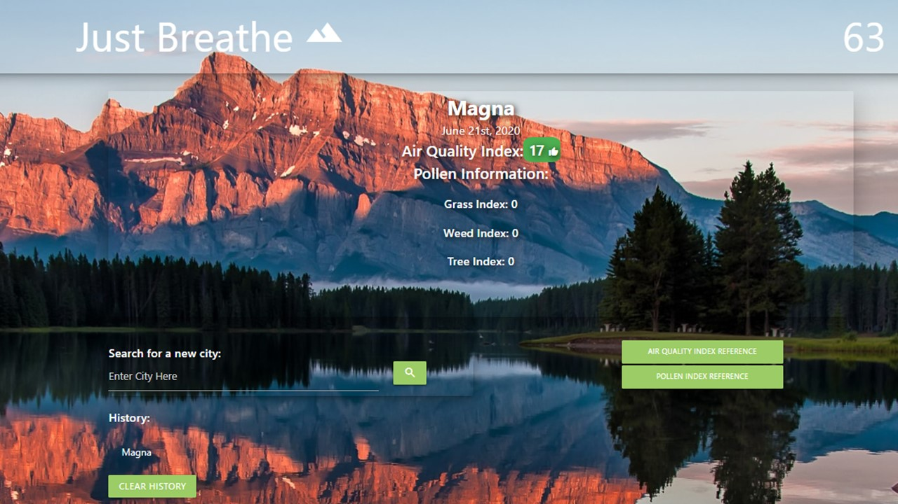
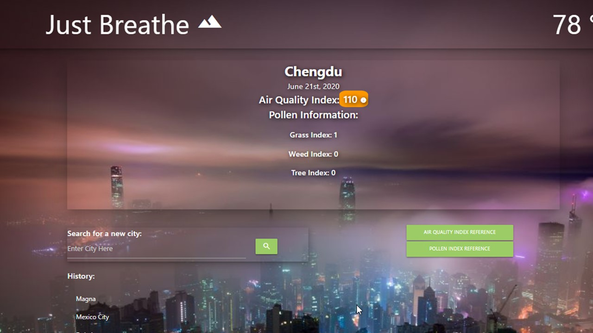
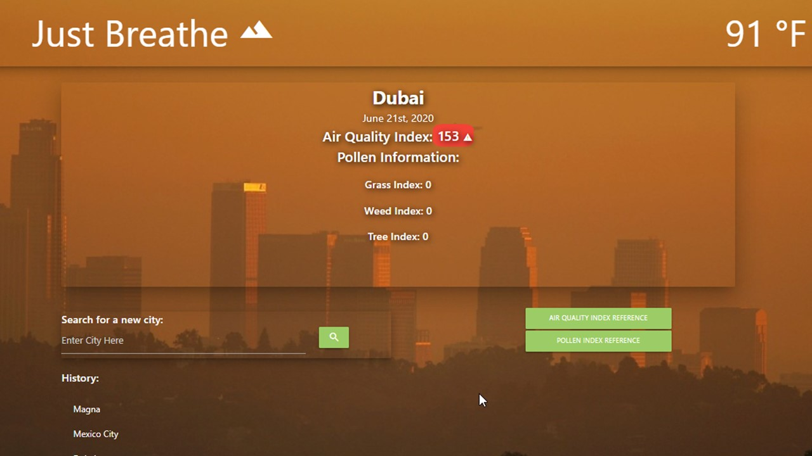
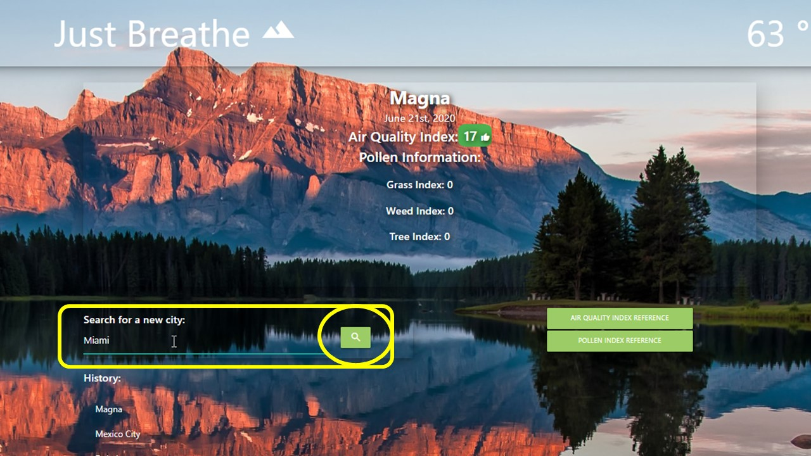
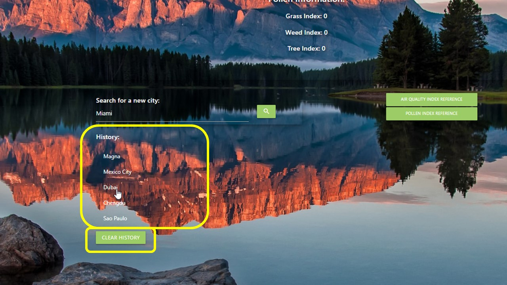
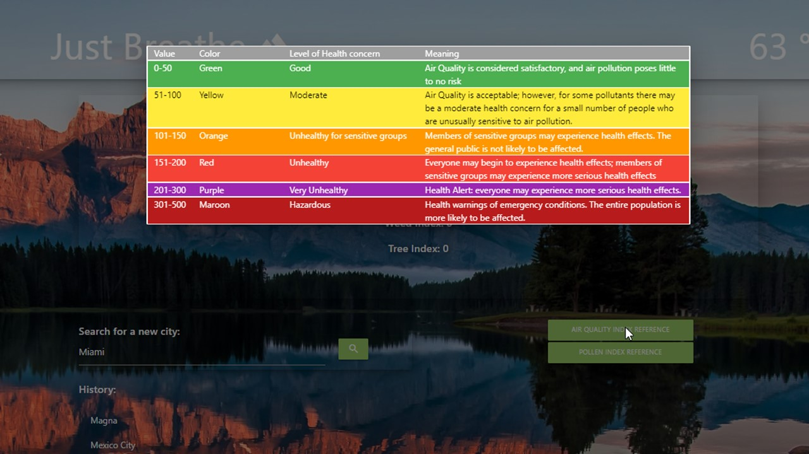
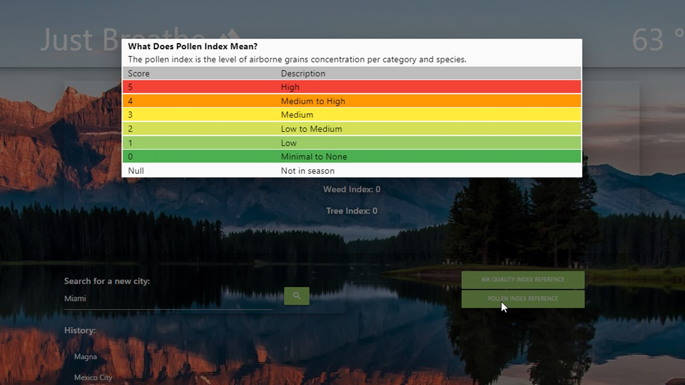

# Just Breathe

## Description
An application that uses third-party API:"Air Visual" and "Climacell", to display air quality index, pollen count and temperature for a given city.

## Motivation for development
Given the current situation with global warming, the level of air quality is getting worse, pollution and pollen allergies are getting worse. We wanted to create an application to help people with respitory concerns, that wants to plan their day outside, and check if their city has a good air quality and types of pollen count.  
We also included the posibility to search for other cities information and gave our users the chance to know what are those indexes before move or travel to other cities. This page is good for everyone even if they don't know much about what those indexes are we have two different references table for them to check the differnts levels of Air Quality and Pollent Count.

## Features
* When users open the application the page display Air quality, Pollen count types and temperaure for current location. 

*The main image is gonna change depending on how serious is the Air Quality Index.

* The users can also search for a different city information on the Input field and is presented with that information and added to the search history.

* If the user wanted to search a city that is on the search history is presented with Air quality index and Pollen count types for that city.

* On the application there is more information available about the air quality index and pollen count types, to access them go to: 
 
 *Air Quality Index Reference
  

  
  *Pollen Index Reference

## Built With
* HTML
* CSS
* JavaScript
* JQuery

## API and Libraries
* Materialize 
* moment.js 
* jQuery
* WebStorage - LocalStorage to storage persistence data: save all searches
* Air Visual https://www.iqair.com/ - to get Air Quality information.
* Climacell https://developer.climacell.co/v3/reference - to get pollent count information.
* GeoIPLookup.io https://geoiplookup.io/api - to get local information.

## Website
To visit the page go to:
https://siwel20.github.io/just-breathe/

## Github
* Group work was done in the following Github repository: https://github.com/parkerrobison/just-breathe
* A copy of the group work has been added to my repository at: https://github.com/siwel20/just-breathe

## Contribution

* @parkerrobison - Display/layout, materialize, history data: display only 6 cities, github, merging, and error handling. 
* @jasonmcgill - Get visitor's long and lat function. Display current city and date. Display modals for error handling.
* @siwel20- Listener and button click handler for search city data. Created the pollen modal and reference button formating.
* @florhaidee - Air quailty index: Fetch information and Display.  History data namevvalidation. Search by History. 
* @MatthewMcFadden - Pollen count fetch.  Display temperature function. History data: save and display

